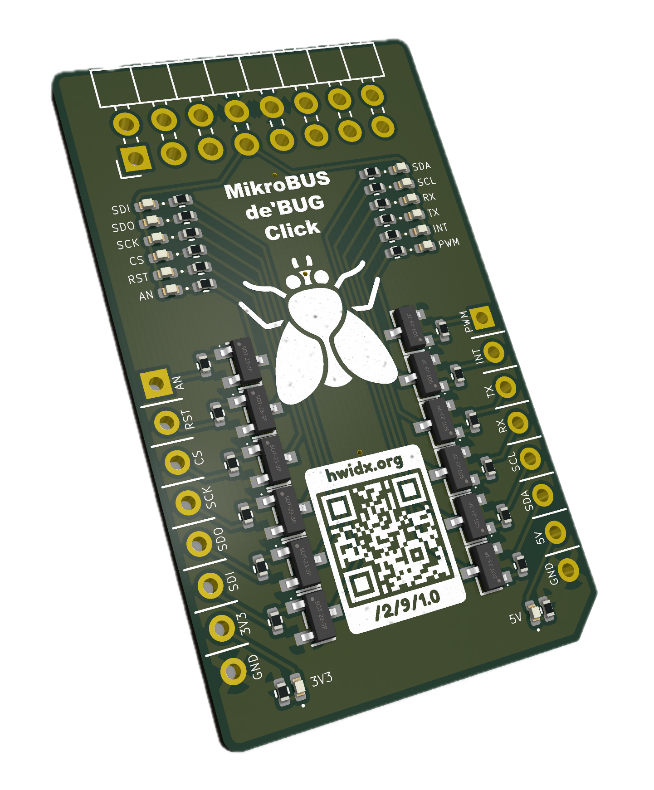
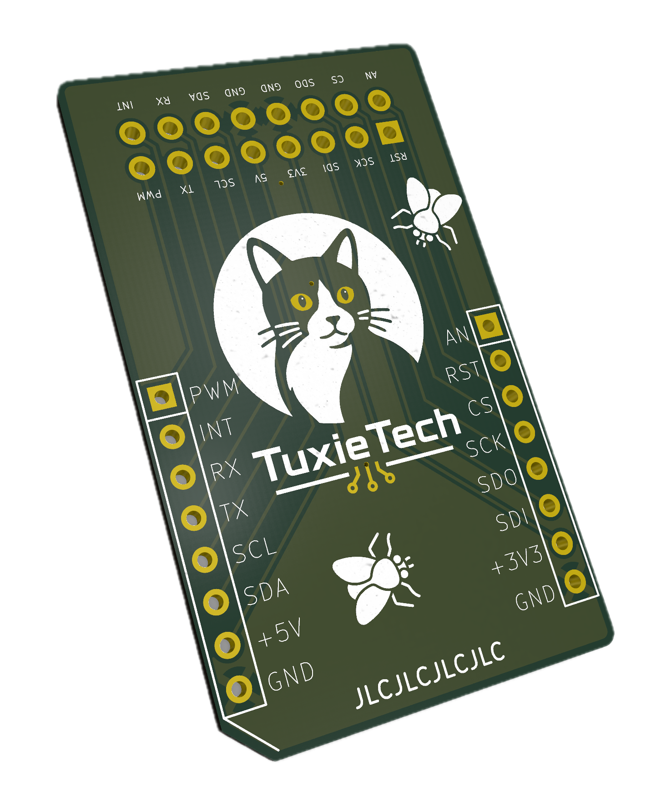

The MikroBUS de'BUG Click is a small development and test board for working with MikroBUS-compatible hardware.
It brings useful signals and power connections out to clearly labelled pads, making it easier to inspect a circuit, connect a probe, or check how a board behaves while you are developing with it.

Our implementation follows the same electronics as the official TESTER 3 Click, but the components and board layout are arranged somewhat differently on our version.

<x-shelf>
    <x-card>
        <x-photo></x-photo>
        <x-caption>The de'BUG Click from the front.</x-caption>
    </x-card>
    <x-card>
        <x-photo></x-photo>
        <x-caption>The rear of the board, showing its component arrangement.</x-caption>
    </x-card>
</x-shelf>

The board is intended to sit between your development tools and a MikroBUS circuit while you investigate signals.
The labels identify common connections such as `3V3`, `5V`, `GND`, serial signals, I2C, SPI, interrupt, and PWM.
Use the matching labelled pad when you need to observe or access one of those signals.

As with any test board, begin with the power disconnected.
Check the signal name and voltage you expect, connect your probe or jumper carefully, and then power the circuit before taking a measurement.
The de'BUG Click is most useful as a clear reference and access point while bringing up a board, tracing a connection, or confirming that a peripheral is responding as expected.

## What is different here?

The official TESTER 3 Click is the reference design for the electronics used by this board.
We have kept that electronic behaviour, but produced our own implementation with a different physical arrangement.

